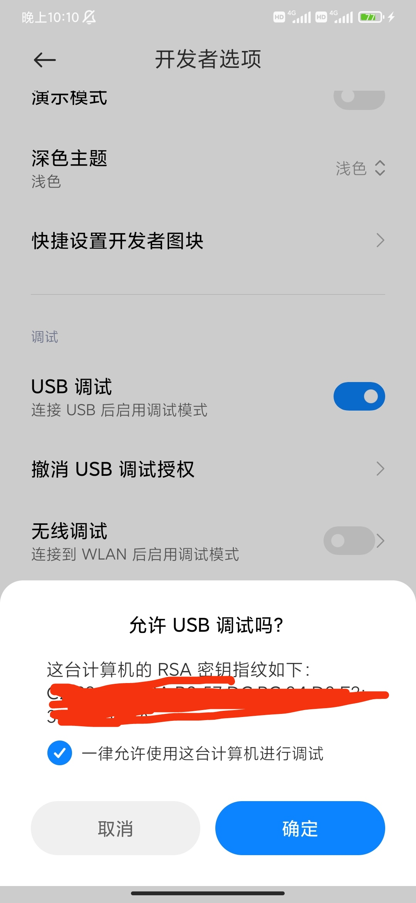
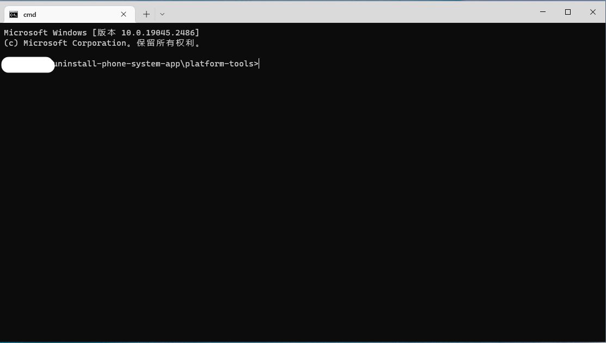
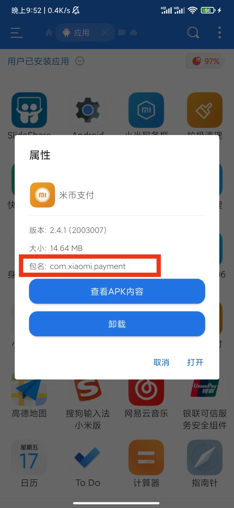

# uninstall-phone-system-app
> 不用root, 卸载 Android 手机预安装应用

我们平时买的Android手机，都会随着系统安装一些软件。但是，这些软件是不能被直接卸载掉的。今天就分享一个不用root手机就可以卸载掉手机预装的软件的教程。我这里是在 **小米9** 上卸载系统安装时候的一些预装软件，其他机型尚未测试，欢迎贡献

### 需要的软件

- 【电脑】platform-tools_r33.0.3-windows [地址1](https://developer.android.com/studio/releases/platform-tools) [备用地址](https://androidsdkmanager.azurewebsites.net/Platformtools)
- 【手机】**ES文件浏览器** or **App Inspector**

### 步骤

第一，**打开手机的开发者模式**。这一步大家可以自行百度。电脑链接上数据线后，开发者模式下，当打开 USB 调试，手机中就会询问 **允许 USB 调试吗？** 点击 **确定** 按钮就可以了。如下图



第二，在 platform-tools_r33.0.3-windows 文件夹下执行下面的命令。



```shell
platform-tools> adb devices
List of devices attached
32822b42        device
```

第三， 卸载软件

```shell
adb shell pm uninstall --user 0 {pkg_name}
```

> 步骤3中的 {pkg_name} 可以通过ES文件浏览器来查看, 如下图



我们就可以执行命令卸载软件了

```shell
adb shell pm uninstall --user 0 com.xiaomi.payment
```

以上就是如何卸载手机预装应用的全部步骤了，欢迎大家贡献其他的方法~


### References

[1] https://www.techmesto.com/uninstall-pre-installed-apps-from-android-phone/

[2] https://www.xda-developers.com/waze-android-auto-coolwalk/

[3] https://developer.android.com/studio/command-line/adb
